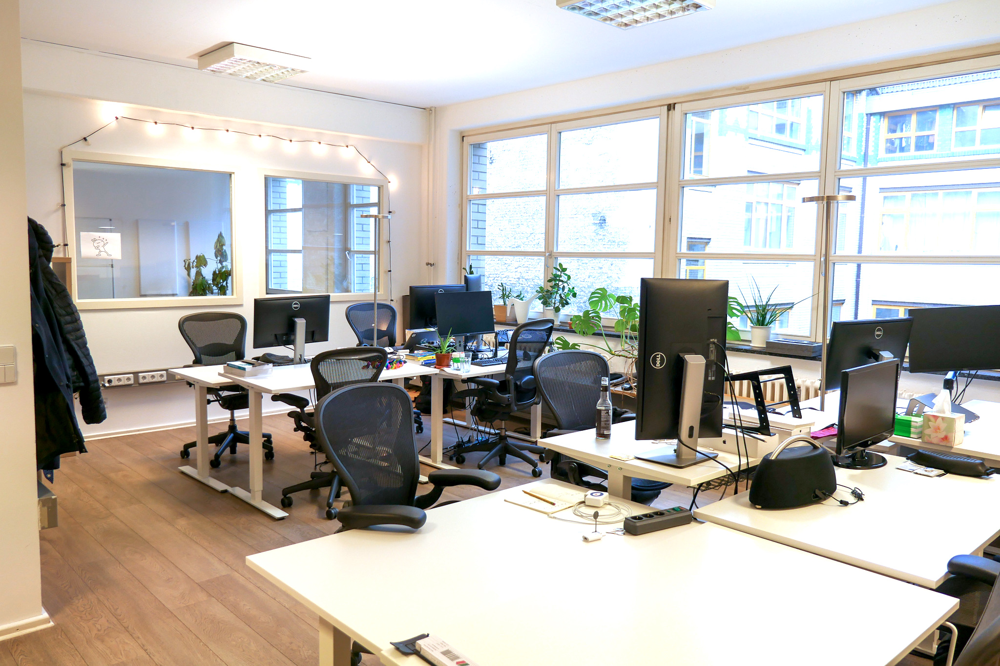
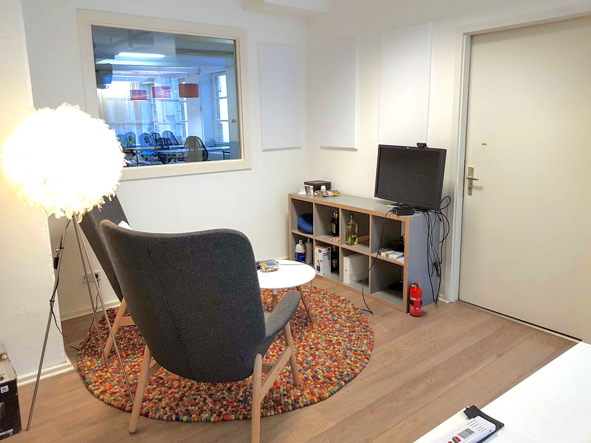

<h1>
  Office in Kreuzberg for rent
  starting April 2022
</h1>

 Are you searching for an office that is well-connected and located in a historic industrial building at the heart of Berlin’s independent tech community? We have a new opening and would love to have you in our space.

<h2>Your office in the heart of Kreuzberg</h2>

  Our current tenants are moving out and the office will be available starting on <strong>April 1, 2022</strong>. We’re sad to see them go, but excited to see who will move in next.

  About the space: You’ll find the office on the third floor of a classic Berlin factory building located directly next to Kottbusser Tor. The office is located in co.up, a community space that provides affordable event and workshop areas as well as coworking.

Our ideal tenants will enjoy the benefits of working inside a community space for the local tech and creative scene and can commit to supporting our values and the <a href="code-of-conduct/">Code of Conduct</a>.

* Available from April 1st, 2022
* EUR 2890 / month (excl. tax)
* Main office room: 42sqm, own lockable door ([groundplan](/photos/3rd-floor-groundplan.jpg))
* Meeting room for ca. 5 people (usage not exclusive, availability might overlap with coworking and other bookings)
* Large event & workshop space (usage not exclusive, availability might overlap with coworking and other bookings)
* Shared kitchen and bathrooms
* Elevator
* 100 MBit Internet and Wifi included
* Weekly cleaning included
* Bike parking available in courtyard

  For more information, please contact <a href="mailto:hello@co-up.de">hello@co-up.de</a>. We’d be happy to answer your questions.

